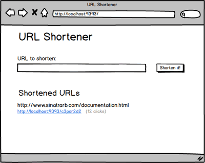

# URL Shortener

## Введение
Мы собираемся создать клон [Bitly][]. Что Bitly делает? URL могут быть очень длинными, из-за чего ими неудобно делиться. Bitly предоставляет сервис, который создает короткие и более удобные URL. Когда пользователь переходит по короткому Bitly URL, сервер отвечает тем, что производит редирект на изначальный, более длинный URL.

Попробуйте. Нажмите на эту ссылку:  [https://bit.ly/2DXRTOG](https://bit.ly/2DXRTOG).

Что случилось? Если мы откроем вкладку Network в Developer Tools и снова перейдем по Bitly ссылке, мы увидим, что ответ от сервера Bitly имеет статус [301][wikipedia 301]. Если мы чуть углубимся и посмотрим на заголовки ответа, мы заметим, что заголовок location показывает, куда перейти браузеру.

Во время разработки данного веб-приложения мы сфокусируемся на маршрутах Express и моделях Mongoose.

## Релизы
### Релиз 0: Постройте MVP
  
*Рис 1*.  Макет приложения

На Рис 1 изображена анимация, которая демонстрирует, как наше приложение работает. На главной странице расположена форма, куда пользователь вводит URL. Когда форма отправлена, наше приложение сохраняет объект, представляющий URL. Объекты-URL представлены на главной странице и в первоначальном, и в сокращенном виде. Когда пользователь переходит по короткому  URL, он перенаправляется на первоначальный адрес.

Нам будет нужен один ресурс для приложения: модель `Url`. У нашей модели будет два атрибута: длинный и короткий URL. Создавать эти объекты мы будем на основе пользовательского ввода. Пользователи предоставляют длинный URL. Мы должны перед сохранением объекта создавать короткий адрес.

*Замечание:*  Необходимые маршруты уже прописаны, но мы должны завершить и заполнить их.

### Релиз 1:  Запрос Счётчика для каждого короткого URL
Пользователи рады нашему сервису по сокращению URL, но они запрашивают дополнительный функционал. Когда они делятся сокращенной ссылкой, им хочется знать, сколько раз этой ссылкой воспользовались.

Нам надо обновить наше приложение, чтобы получить счетчик, который будет показывать, сколько раз он получает запрос для каждого URL. Чтобы это сделать, нам нужно ...

- Обновить базу данных, чтобы следить за количеством визитов каждого URL.
- Обновить подходящий обработчик маршрута так, чтобы в любой момент, когда вызывается короткий URL, обновлялся счетчик для конкретного URL.
- Обновить главную страницу так, чтобы отображать количество вызовов каждого короткого URL ([mockup](readme-assets/counter.png)).

### Релиз 2:  Валидация URL и обработка ошибок.
Мы получили отзыв, в котором сказано, что наши короткие ссылки не работают и отправляют пользователей на неправильные  URL.
We've received some user feedback saying that our short links are broken, sending users to bad URLs.  We've looked into the issue and noticed that users are supplying incomplete URLs.  For example, the user submits "google.com" rather than "http://google.com".  In other words, the problem is with the user input, but it looks like the problem is on our end, and of course, we need to do something about it.

If a user submits an invalid URL, we don't want to provide them with a short URL; instead, we want to alert them to the problem and provide the opportunity to correct the input (see Figure 2).  To accomplish this, we'll add an [Active Record validation][ActiveRecord validations] to our `Url` model.  There are different approaches to determining what constitutes a valid URL.  For our purposes, we'll say that a valid URL begins with "http://" or "https://".

Add an Active Record validation to the `Url` model to validate that a URL begins with "http://" or "https://".

  
*Figure 2*.  Alerting users that a URL is invalid.

As we've learned in [previous challenges][validations intro challenge], when we attempt to save, create, or update an Active Record object, Active Record will first validate the object.  If any validations fail, the object is invalid, and Active Record will not try to write to the database.  But, for each failing validation, Active Record will note the failure in the object's [errors][].  We should leverage our understanding of validations and errors to update the route handler in which we persist `Url` objects.

## Conclusion
Having completed this challenge, we should be familiar with an Active Record object's life cycle events:  validation, save, update, destroy, etc.  We should be able to set up callbacks that execute when one of these events occur.  In this challenge we added a callback that executed before a `Url` object was saved to gave it a short URL.

We should also be able to provide a good user experience when something fails.  For example, in this challenge we built `Url` objects from user input.  But, we had to account for the fact that sometimes users supply invalid input.  We updated our route handler, so that we were able to inform users if something went wrong and provide an opportunity to correct the issue.

[ActiveRecord validations]: http://guides.rubyonrails.org/active_record_validations.html
[bitly]: http://bitly.com/
[errors]: http://guides.rubyonrails.org/active_record_validations.html#working-with-validation-errorsactive_record_validations.html#validations-overview-errors
[HTTP status codes]: http://en.wikipedia.org/wiki/List_of_HTTP_status_codes
[HTTP status cats]: http://httpcats.herokuapp.com/
[rails guides callbacks]: http://guides.rubyonrails.org/active_record_callbacks.html
[validations intro challenge]: ../../../active-record-intro-validations-challenge
[wikipedia 301]: https://ru.wikipedia.org/wiki/HTTP_301

