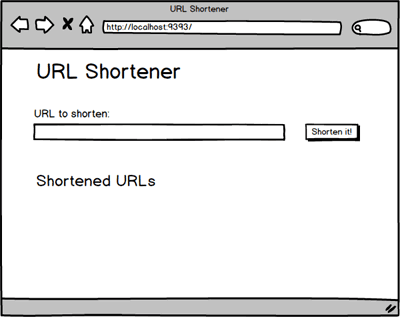

# URL Shortener

## Введение
Мы собираемся создать клон [Bitly][]. Что Bitly делает? URL могут быть очень длинными, из-за чего ими неудобно делиться. Bitly предоставляет сервис, который создает короткие и более удобные URL. Когда пользователь переходит по короткому Bitly URL, сервер отвечает тем, что производит редирект на изначальный, более длинный URL.

Попробуйте. Нажмите на эту ссылку:  [https://bit.ly/2DXRTOG](https://bit.ly/2DXRTOG).

Что случилось? Если мы откроем вкладку Network в Developer Tools и снова перейдем по Bitly ссылке, мы увидим, что ответ от сервера Bitly имеет статус [301][wikipedia 301]. Если мы чуть углубимся и посмотрим на заголовки ответа, мы заметим, что заголовок location показывает, куда перейти браузеру.

Во время разработки данного веб-приложения мы сфокусируемся на маршрутах Express и моделях Mongoose.

## Релизы
### Релиз 0: Постройте MVP
  
*Рис 1*.  Макет приложения

На Рис 1 изображена анимация, которая демонстрирует, как наше приложение работает. На главной странице расположена форма, куда пользователь вводит URL. Когда форма отправлена, наше приложение сохраняет объект, представляющий URL. Объекты-URL представлены на главной странице и в первоначальном, и в сокращенном виде. Когда пользователь переходит по короткому  URL, он перенаправляется на первоначальный адрес.

Нам будет нужен один ресурс для приложения: модель `Url`. У нашей модели будет два атрибута: длинный и короткий URL. Создавать эти объекты мы будем на основе пользовательского ввода. Пользователи предоставляют длинный URL. Мы должны перед сохранением объекта создавать короткий адрес.

*Замечание:*  Необходимые маршруты уже прописаны, но мы должны завершить и заполнить их.

### Релиз 1:  Запрос Счётчика для каждого короткого URL
Пользователи рады нашему сервису по сокращению URL, но они запрашивают дополнительный функционал. Когда они делятся сокращенной ссылкой, им хочется знать, сколько раз этой ссылкой воспользовались.

Нам надо обновить наше приложение, чтобы получить счетчик, который будет показывать, сколько раз он получает запрос для каждого URL. Чтобы это сделать, нам нужно ...

- Обновить базу данных, чтобы следить за количеством визитов каждого URL.
- Обновить подходящий обработчик маршрута так, чтобы в любой момент, когда вызывается короткий URL, обновлялся счетчик для конкретного URL.
- Обновить главную страницу так, чтобы отображать количество вызовов каждого короткого URL ([mockup](readme-assets/counter.png)).

### Релиз 2:  Валидация URL и обработка ошибок.
Мы получили отзыв, в котором сказано, что наши короткие ссылки не работают и отправляют пользователей на неправильные  URL. Мы посмотрели отчет об ошибке и заметили, что пользователи вводят не полные URL. Например, пользователь вводит "google.com" вместо "http://google.com". Другими словами, проблема в пользовательском вводе, но выглядит это так, будто проблема на нашей стороне и конечно нам нужно что-то с этим сделать.

Если пользователь отправляет невалидный URL, мы не хотим предоставлять ему короткую ссылку; вместо этого его нужно предупредить о проблеме и показать, как можно исправить ввод (см Рис 2). Чтобы сделать это, мы добавим [Mongoose validation][Mongoose validations] к нашей модели `Url`. Можно несколькими способами определить, из чего состоит валидный URL. Для нашей цели, скажем, что валидный URL начинается с "http://" или "https://".

Добавьте Mongoose validation к модели `Url`, чтобы проверить, что URL начинается с "http://" или "https://".

  
*Рис 2*.  Предупреждение пользователя о невалидном URL

Валидация в Mongoose - это middleware, который срабатывает перед сохранением объекта. Если валидация не пройдена, объект не получится сохранить и ошибки будут содержаться в объекте ValidatorError. У такого объекта есть атрибуты  kind, path, value, и message. В некоторых случаях появляется свойство reason. Необходимо разобраться с тем, как пользоваться валидаторами и что происходит при проверке объекта.

## Заключение
После завершения этого задания, мы должны уметь разбираться с жизненным циклом объекта Mongoose: валидация, сохранение, обновление, удаление и так далее. Мы должны уметь обрабатывать эти действия. В этом задании мы добавили функцию, которая срабатывает перед тем, как объект `Url` сохраняется, чтобы получить короткий URL.

Нам также нужно уметь предоставить хороший интерфейс для пользователей, когда случается ошибка. Например, в этом задании мы создаем объекты  `Url` из ввода пользователя. Но мы должны учесть тот факт, что иногда пользователи вводят некорректные данные. Мы обновили обработчик маршрутов, так что теперь, если что-то пойдет не так, мы уведомим пользователя об ошибке и подскажем, как можно её исправить.

[Mongoose validation]: https://mongoosejs.com/docs/validation.html
[bitly]: http://bitly.com/
[HTTP status codes]: https://ru.wikipedia.org/wiki/%D0%A1%D0%BF%D0%B8%D1%81%D0%BE%D0%BA_%D0%BA%D0%BE%D0%B4%D0%BE%D0%B2_%D1%81%D0%BE%D1%81%D1%82%D0%BE%D1%8F%D0%BD%D0%B8%D1%8F_HTTP
[HTTP status cats]: http://httpcats.herokuapp.com/
[Mongoose queries]: https://mongoosejs.com/docs/queries.html
[wikipedia 301]: https://ru.wikipedia.org/wiki/HTTP_301

